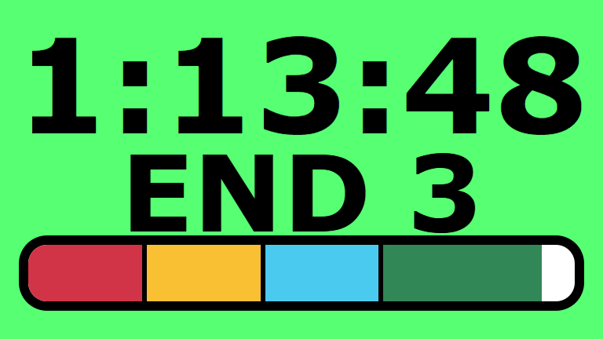
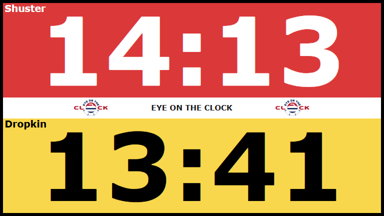
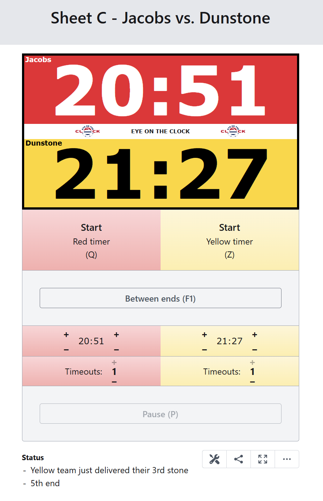

# Eye on the Clock
The most advanced timing software for curling matches

## Features
- Basic timers
  - Unmanaged countdown timer
  - Shows current end & progress through the end
  - Multiple timer expiration strategies
  - Pre-game countdown
  - Audible alerts
- Competition timing (thinking time)
  - Fully customizable timer settings - timings, colors, names, timeouts, and more
  - Whole-game time or per-end time (and more)
  - Supports timeouts, between ends, prep time, mid-game break, extra ands, and more
  - Pre-event practice, pre-game warmup, and LSD timers
  - Game log and ability to replay an end
- Networking and extensibility
  - Web hooks - easily integrate with other infrastructure
  - REST API and WebSockets API
  - Timer sharing
  - OBS/streaming integration
- Other functionality
  - Multi-client support
  - Works on any device with a modern browser (PC, Mac, Linux, Raspberry Pi, Android, iOS)
  - Supports any screen size and orientation - text fills available space
  - Keyboard shortcuts
  - Real-time updates
  - Secure timer operator access
  - Customizable timer presets
  - Available as a desktop app or standalone server
  - Disaster recovery - restore timers even after a power outage (some features still under development)

  ## Screenshots
  ### Basic timer
  

  ### Competition timer
  

  ### Operator view
  

  ## Status
  The full Eye on the Clock system consists of three components:
  - (Beta) Eye on the Clock Server (free and open souce)
    - Source code will be available at the time of first stable release
  - (Under development) Button box - a player-operated device for controlling a timer during a game
  - (Under development) Stone tracker - a computer vision system for automatically controlling timers

  The button box and stone tracker are under active development and not yet available. Until they are ready, the Eye on the Clock Server can be used with manual operators or for basic timing.

  ## Demo
  A demo version of the Eye on the Clock Server is available at https://eyeontheclock.com. For real-world use, the EotC Server must be installed locally at your facility.

  